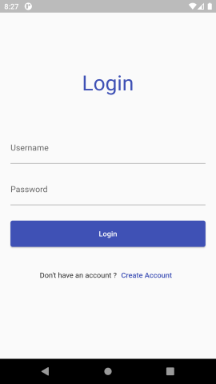
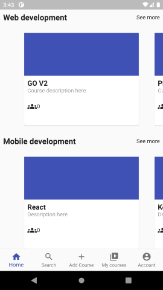
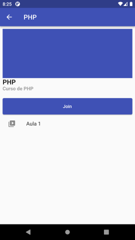
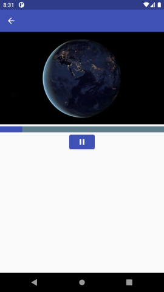

# Plataforma de cursos

Aplicativo desenvolvido para a disciplina de Desenvolvimento para Dispositivos Móveis.

O projeto consiste em um aplicativo de cursos utilizando os conceitos ensinados na disciplina.

Acesse o repositório da api [aqui](https://github.com/heldersonbarros/drf-course-platform).

## Funcionalidades

- Registrar/Login
- Criação de cursos
- Usuários do tipo estudante podem se juntar ao cursos
- Assistir aulas

## Screenshots

 \

## Tecnologias utilizadas

- Flutter
- Django Rest Framework